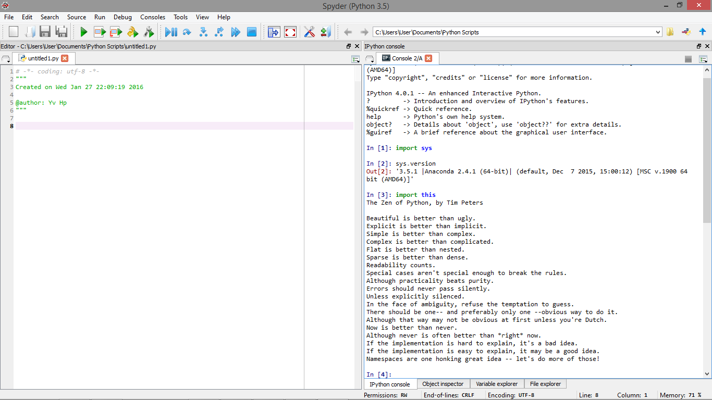

UECM3033 Assignment #1 Report
========================================================

- Prepared by: ** OOI HUI PING**
- Tutorial Group: T2

--------------------------------------------------------

## Task 1 -- setup a github repository

The reports, codes and supporting documents are uploaded to Github at: 

[https://github.com/OoiHp/UECM3033_assign1](https://github.com/your_github_id/UECM3033_assign1)

---------------------------------------------------------

## Task 2 -- setup python

Put here the screen shot of file (python.png)

------------------------------------------------------------

## Task 3 -- modify and run Python script

In this section, please report:

1. The hexadecimal value of your student ID.
   Hexadecimal representation of 1308097 is 0x13f5c1

2. Write down the definite integrals that you have chosen.
   $$\int_0^{1} 2^{\sqrt{x}} dx = -\frac{2}{\log{2}^2}+\frac{4}{\log{2}}.$$

3. Write down your system of 10 linear equations.
   \begin{align*}
   -x_0 +9x_1+8x_2+8x_3+9x_5+1x_6+3x_7+2x_8-6x_9 &= 66,\\
   -x_1+2x_2+4x_3+2x_4+7x_5+7x_6+5x_7+6x_8+x_9 &= 42,\\
   2x_0-x_2+2x_3+5x_5-2x_7+2x_8+6x_9 &= 28,\\
   x_1+7x_2-5x_3+x_4+6x_5-9x_6+5x_7+3x_8+x_9 &= 20,\\
   9x_0 +9x_1+8x_2+6x_3-7x_4-8x_5+8x_7+6x_8+5x_9 &= 72,\\
   x_1+2x_2+4x_3-3x_4-3x_5+5x_6+9x_7+8x_8+3x_9 &= 52,\\
   5x_0 +3x_1-3x_3+x_4+8x_5-5x_6+2x_7+x_8+5x_9 &= 34,\\
   x_1-3x_2+x_3+7x_4+6x_5+9x_6-4x_7+4x_8+8x_9 &= 58,\\
   9x_0 -3x_1+2x_3+5x_5+5x_6+4x_7-6x_8+5x_9 &= 42,\\
   -6x_0 +3 x_1+x_3+x_4+4x_5+5x_6+8x_8-4x_9 &=24.
   \end{align*}

   Solution:
	\begin{align*}
	x_0=2, x_1=2, x_2=2, x_3=2, x_4=2, x_5=2, x_6=2, x_7=2, x_8=2, x_9=2
	\end{align*}

-----------------------------------

last modified: 28.01.2016
