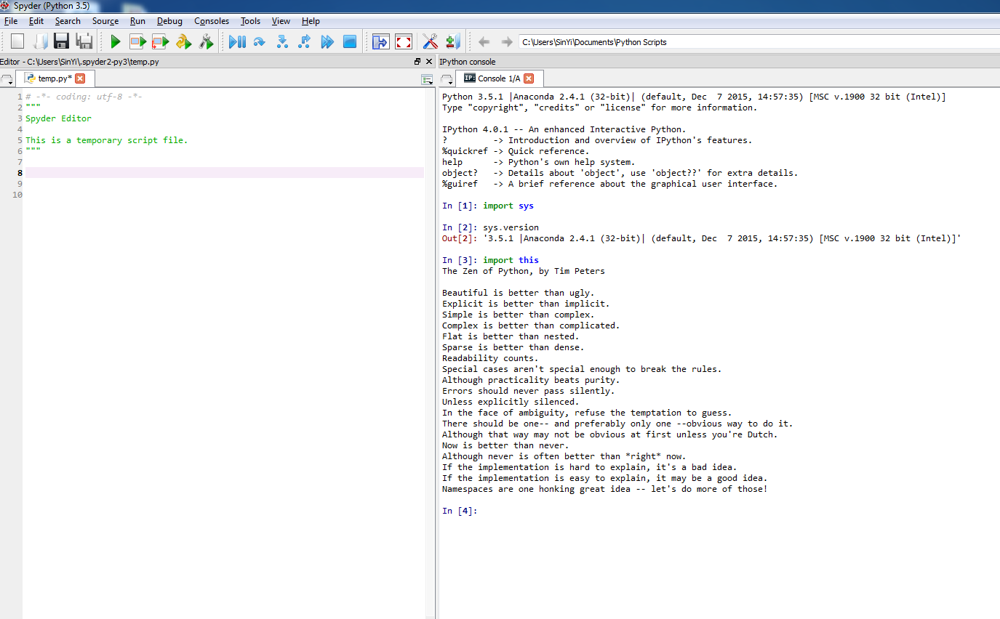

UECM3033 Assignment #1 Report
========================================================

- Prepared by: ** Wong Sin Yi **
- Tutorial Group: T2

--------------------------------------------------------

## Task 1 -- setup a github repository

The reports, codes and supporting documents are uploaded to Github at: 

[https://github.com/your_github_id/UECM3033_assign1](https://github.com/your_github_id/UECM3033_assign1)

---------------------------------------------------------

## Task 2 -- setup python

Put here the screen shot of file (python.png)

------------------------------------------------------------

## Task 3 -- modify and run Python script

In this section, please report:

1. The hexadecimal value of your student ID.

    Hexadecimal representation of 1308250 is 0x13f65a

2. Write down the definite integrals that you have chosen.

    $$\int_0^{\infty} e^{-x}{sin{2x}} dx = \frac{2\5}.$$

3. Write down your system of 10 linear equations.

    The system of 10 linear equations: 
    \begin{align*} x_1 +9 x_2 +9 x_3 +9 x_4 +9 x_5 +9 x_6 +9 x_7 +9 x_8 +9 x_9 +9 x_10 &= 194, \\
                   x_1 +x_2 +8 x_3 +8 x_4 +8 x_5 +8 x_6 +8 x_7 +8 x_8 +8 x_9 +8 x_10 &= 192, \\
		   x_1 +x_2 +x_3 +7 x_4 +7 x_5 +7 x_6 +7 x_7 +7 x_8 +7 x_9 +7 x_10 &= 210, \\
		   x_1 +x_2 +x_3 +x_4 +6 x_5 +6 x_6 +6 x_7 +6 x_8 +6 x_9 +6 x_10 &= 126, \\
                   x_1 +x_2 +x_3 +x_4 +x_5 +5 x_6 +5 x_7 +5 x_8 +5 x_9 +5 x_10 &= 150, \\
		   x_1 +x_2 +x_3 +x_4 +x_5 +x_6 +4 x_7 +4 x_8 +4 x_9 +4 x_10 &= 144, \\
		   x_1 +x_2 +x_3 +x_4 +x_5 +x_6 +x_7 +3 x_8 +3 x_9 +3 x_10 &= 120, \\
		   x_1 +x_2 +x_3 +x_4 +x_5 +x_6 +x_7 +x_8 +2x_9 +2x_10 &= 80, \\
		   x_1 +x_2 +x_3 +x_4 +x_5 +x_6 +x_7 +x_8 +x_9 +2x_10 &= 72, \\
		   x_1 +x_2 +x_3 +x_4 +x_5 +x_6 +x_7 +x_8 +x_9 +x_10 &= 66, \\ \end{align*}

Here are the examples of how to add equations in markdown:

$$\int_0^{\infty} e^{-x^2} dx = \frac{\sqrt{\pi}}{2}.$$

\begin{align*}
3 x_0 +x_1 &= 9,\\
x_0 + 2 x_1 &= 8.
\end{align*}

-----------------------------------

last modified: change your date here
